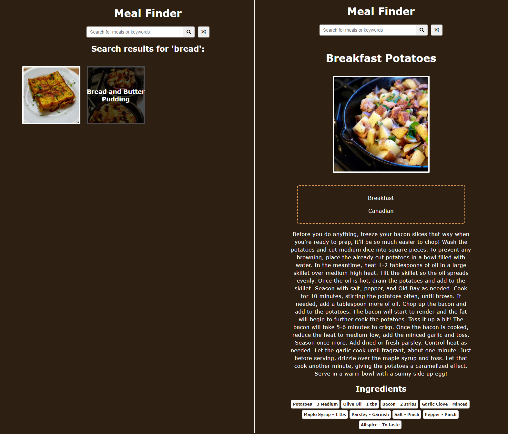
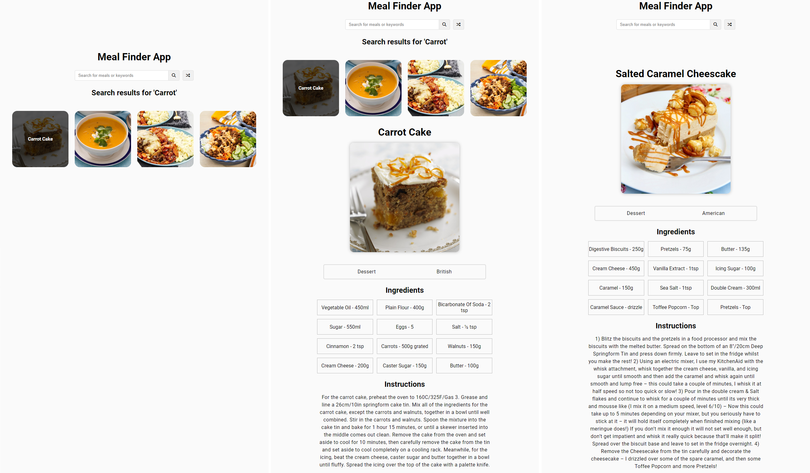

# Udemy--vanillawebprojects-08

**The eighth** of a series of **20 small projects** in **Vanilla JavaScript** from the [**Udemy course**](https://www.udemy.com/course/web-projects-with-vanilla-javascript/) by author [Brad Traversy](https://www.traversymedia.com/) with this [Brad's original GitHub repository](https://github.com/bradtraversy/vanillawebprojects).

# 08: Mealfinder App

Search and generate random meals from the [themealdb.com](https://www.themealdb.com/) API

## Project Specifications

- **Display UI** with form to search and button to generate
- **Connect to API** and get meals
- **Display meals** in DOM with image and hover effect
- **Click on meal** and see the details
- **Click on generate** button and fetch & display a random meal

## Original preview

    

## My solution preview

    

## My solution features

- Custom **UI/UX design**
- Other features **are the same as** in the original Brad’s solution.

# Author

Website - [Petr Bednarski](https://github.com/pettik)  
Frontend Mentor - [@pettik](https://www.frontendmentor.io/profile/pettik)
